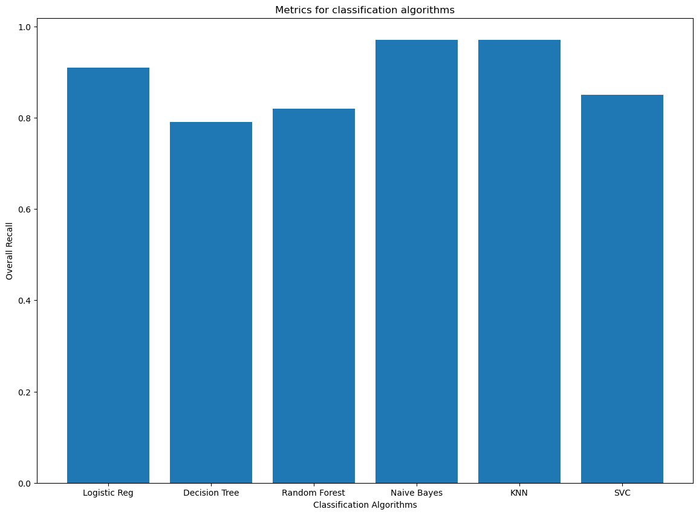
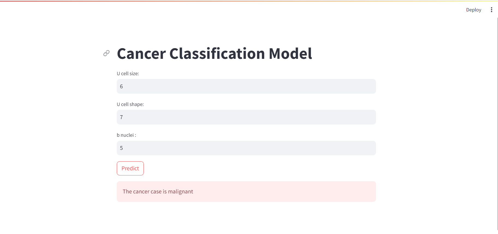

#### Cancer Classification Model

`Problem Statement`

A health facility has been experiencing a lot of death due to cancer with a few survivors. They’ve recently been told on how AI can be used to predict whether a cancer case is benign or malignant on the fly without having the patient go through rigorous/expensive procedures.

`Data Understanding`

The data contains 9 columns including clump, 'ucellsize, 'ucellshape, 'mgadhesion, sepics, 'bnuclei',
       'bchromatin', 'normnucl', 'mitoses', 'classe'

`Approach`

- Examine the possibility of predicting the malignity of cancer by building ML models and verifying the accuracy of predictions.

- Get a historical dataset containing info on various cases and certain properties/characteristics that were present.

- Build ML models by trying out several algorithms and evaluating metrics 

- Since the stakeholders are interested in predicting malignant cases correctly, the recall for the malignant class would observed closely i.e we want our model to be able to identify all malignant cases in the test data

`Results`

- Naives Bayes and KNN have the best metric for recall. We'd pick the KNN model because of interpretability and the size of the training data

`UI of deployed model`

